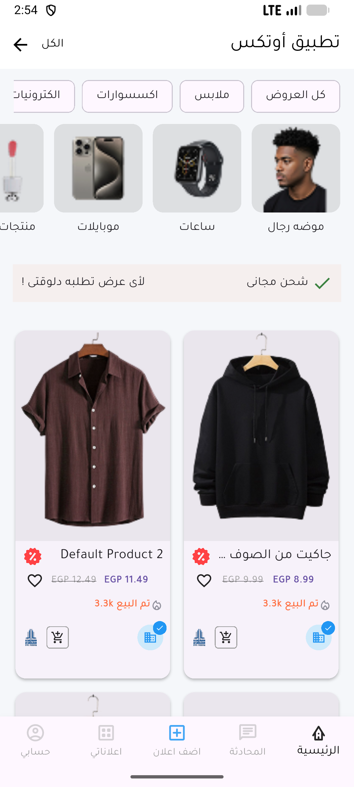
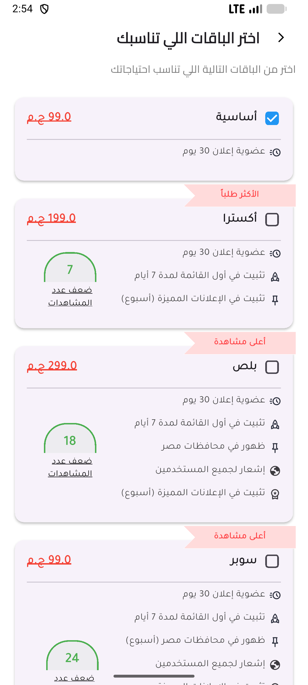
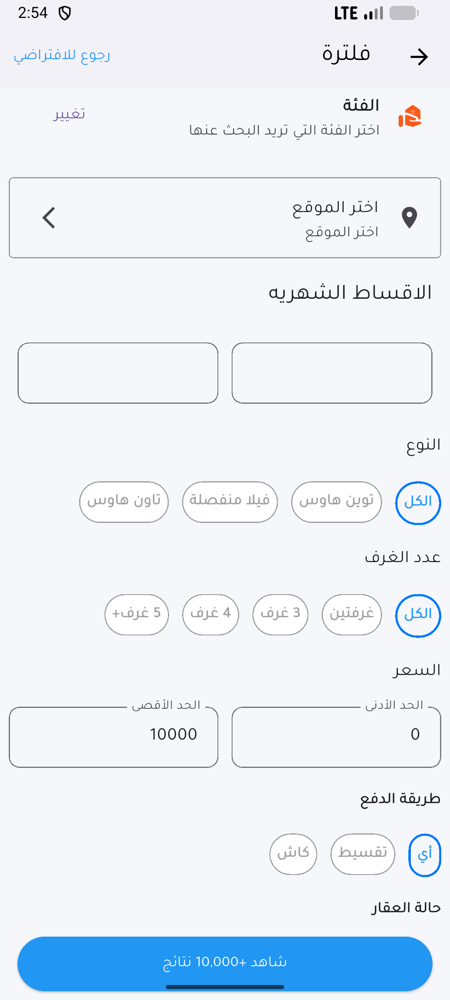

# Otex App

Otex App is a Flutter application designed to provide a seamless experience for users to browse, filter, and manage various listings. The app leverages a clean and intuitive user interface to enhance user interaction and accessibility.

## Features

- **Category Filtering**: Users can easily filter listings by various categories such as apartments, villas, offices, shops, and land.
- **Location Selection**: The app allows users to select specific locations to narrow down their search results.
- **Price Range**: Users can define minimum and maximum price ranges for listings.
- **Property Type**: Filter listings by property types like twin houses, detached villas, and townhouses.
- **Number of Rooms**: Users can specify the desired number of rooms in a property.
- **Payment Method**: Filter options include installment or cash payment methods.
- **Property Condition**: Users can search for properties that are either under construction or ready.
- **Responsive UI**: The application is built with Flutter, ensuring a consistent and responsive user experience across different devices.

## Getting Started

This project is a starting point for a Flutter application.

A few resources to get you started if this is your first Flutter project:

- [Lab: Write your first Flutter app](https://docs.flutter.dev/get-started/codelab)
- [Cookbook: Useful Flutter samples](https://docs.flutter.dev/cookbook)

For help getting started with Flutter development, view the
[online documentation](https://docs.flutter.dev/), which offers tutorials,
samples, guidance on mobile development, and a full API reference.

## Screenshots

### Home Screen

### Filter Screen

### Packages Screen

